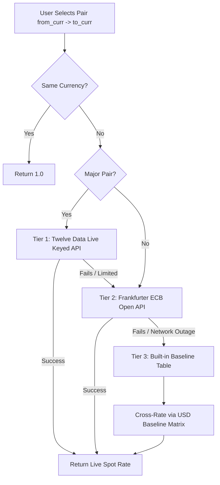

# 🛡️ CurrencyGuard — Complete Codebase & Architecture Guide

This document explains how **CurrencyGuard** works under the hood: where the APIs are located, how real-time rates are calculated, how charts/diagrams are rendered, and how the Streamlit frontend coordinates everything.

---

## 📑 Table of Contents
1. [Where the APIs Live & How They Work](#1-where-the-apis-live--how-they-work)
2. [Dual-Engine Data Pipeline & Fallback System](#2-dual-engine-data-pipeline--fallback-system)
3. [How Real-Time Showing Works](#3-how-real-time-showing-works)
4. [How Charts & Diagrams Are Generated](#4-how-charts--diagrams-are-generated)
5. [Breakdown of Main UI Modules in `app.py`](#5-breakdown-of-main-ui-modules-in-apppy)
6. [Mathematical Engine (Risk & Indicators)](#6-mathematical-engine-risk--indicators)
7. [Directory Structure Reference](#7-directory-structure-reference)
8. [Master Line-by-Line Code Index of `app.py`](#8-master-line-by-line-code-index-of-apppy)
9. [Modular Services & Backend Classes (`services/`, `api/`, `exceptions/`)](#9-modular-services--backend-classes-services-api-exceptions)

---

## 1. Where the APIs Live & How They Work

The API logic lives in two places:
1. **Core Web App Functions** in `app.py`:
   - `fetch_twelve_exchange_rate(pair)` (Line 589)
   - `fetch_frankfurter_latest(base)` (Line 610)
   - `fetch_frankfurter_timeseries(base, target, days)` (Line 636)
   - `get_cross_rate(from_curr, to_curr)` (Line 677)
2. **Modular Service Class** in `api/currency_api.py` and `services/currency_service.py`:
   - Object-Oriented client wrapper with custom exception handling (`APIRequestError`, `DataProcessingError`).

### API 1: Twelve Data (Keyed Live API)
- **File**: `app.py` (L589–L607) and `api/currency_api.py`
- **Base Endpoint**: `https://api.twelvedata.com/exchange_rate?symbol={pair}&apikey={KEY}`
- **Authentication**: Key loaded from `.env` via `TWELVEDATA_API_KEY`.
- **Cache**: `@st.cache_data(ttl=120)` (cached for 2 minutes to protect API credit limits).
- **Purpose**: Provides high-frequency spot rates for major currency pairs like `USD/INR`, `EUR/USD`, and `GBP/USD`.

### API 2: Frankfurter Open API (European Central Bank)
- **File**: `app.py` (L610–L675)
- **Primary Endpoint**: `https://api.frankfurter.dev/v1/latest?from={base}`
- **Failover Endpoint**: `https://api.frankfurter.app/latest?from={base}`
- **Authentication**: **No API key needed** (100% open & free reference data).
- **Cache**: `@st.cache_data(ttl=300)` (cached for 5 minutes).
- **Purpose**: Provides official daily ECB reference rates and historical time-series curves for 30+ world currencies.

---

## 2. Dual-Engine Data Pipeline & Fallback System

To guarantee **zero downtime**, currency lookups go through a 3-tier cascade in `get_cross_rate()`:



### The Math Behind Cross-Rates
If an exotic pair is requested (e.g., `JPY` to `AED`), and no direct endpoint exists:
$$\text{Rate}_{\text{from} \to \text{to}} = \frac{\text{USD\_Rate}(\text{to})}{\text{USD\_Rate}(\text{from})}$$

---

## 3. How Real-Time Showing Works

Streamlit executes `app.py` from top to bottom whenever an input changes or the user clicks an action.

### 1. Smart In-Memory Caching (`ttl`)
- Every HTTP call uses `@st.cache_data(ttl=...)`.
- If 10 widgets ask for `USD/INR` within 2 minutes, **only 1 network request** is made.
- Prevents browser lag and avoids Twelve Data rate limit errors.

### 2. Manual Market Refresh
- In the sidebar, the button `🔄 Refresh Market Data` runs:
  ```python
  st.cache_data.clear()
  st.rerun()
  ```
  This empties the cache and triggers a fresh network fetch immediately.

### 3. Reactive State Management
- `st.session_state` stores:
  - `theme`: `"dark"` vs `"light"`
  - `current_page`: active navigation tab
  - `user_alerts`: in-memory alerts and rules

---

## 4. How Charts & Diagrams Are Generated

Charts are built using **Plotly Graph Objects (`go.Figure`)** in `app.py` (Line 1110):

### 1. Historical Time-Series Fetching
```python
df_trends = fetch_frankfurter_timeseries(t_base, t_quote, days=num_days)
```
Returns a `pandas.DataFrame` with `date` and `rate` columns.

### 2. Computing Technical Indicators
Function `add_technical_indicators(df)` calculates:
- **Simple Moving Average (SMA 20)**: `df['rate'].rolling(20).mean()`
- **Simple Moving Average (SMA 50)**: `df['rate'].rolling(50).mean()`
- **Bollinger Bands**:
  $$\text{Upper} = \text{SMA}_{20} + 2 \times \sigma_{20}$$
  $$\text{Lower} = \text{SMA}_{20} - 2 \times \sigma_{20}$$

### 3. Rendering Plotly Traces
- **Main Line**: Blue line (`#2563eb`) tracking the daily rate.
- **Overlays**: Dot lines for SMA 20/50 or a shaded ribbon (`fill='tonexty'`, `rgba(148, 163, 184, 0.15)`) for Bollinger volatility channels.
- **Theme Sync**: The plot template dynamically switches between `plotly_dark` and `plotly_white` matching the user's active theme.

---

## 5. Breakdown of Main UI Modules in `app.py`

| Module | Code Location | Key Features |
|---|---|---|
| **📊 Dashboard** | Lines 835–940 | 4 live top cards (`USD/INR`, `EUR/INR`, `GBP/INR`, `AED/INR`), 24h percentage change badges, RBI macro summary, volatility status. |
| **💱 Currency Converter** | Lines 941–1029 | Number input × cross-rate, bidirectional inverse rate (`1 USD = X INR`, `1 INR = Y USD`), pair profile with central bank metadata. |
| **📈 Market Trends** | Lines 1030–1167 | Interactive Plotly candlestick/line charts, timeframe selector (7D to 5Y), SMA 20/50 and Bollinger Bands overlay, High/Low/Spread metrics. |
| **⚠️ Risk Analysis** | Lines 1168–1223 | Parametric 95% & 99% Value-at-Risk (VaR), 252-day annualized volatility, peak-to-trough historical drawdown calculation. |
| **🔔 Alerts & Signals** | Lines 1224–1303 | Form to register upper ceiling / lower floor triggers, active monitoring rulebook, live status badge (`🚨 TRIGGERED` vs `🟢 WATCHING`), CSV export. |
| **🌐 Currency Explorer** | Lines 1304–1358 | Searchable directory for 30+ currencies with country, central bank, region filtering, and live INR valuation cards. |
| **ℹ️ Architecture & About** | Lines 1359–1449 | Live endpoint latency tester (Ping Twelve Data & Frankfurter), system diagrams, and mathematical formulation references. |

---

## 6. Mathematical Engine (Risk & Indicators)

Located in `calculate_risk_metrics()` (Line 703):
1. **Daily Returns**:
   $$r_t = \frac{P_t - P_{t-1}}{P_{t-1}}$$
2. **Annualized Volatility**:
   $$\sigma_{\text{ann}} = \sigma_{\text{daily}} \times \sqrt{252} \times 100\%$$
3. **Parametric Value-at-Risk (VaR)**:
   $$\text{VaR}_{95\%} = -(\mu - 1.645 \cdot \sigma)$$
   $$\text{VaR}_{99\%} = -(\mu - 2.326 \cdot \sigma)$$
4. **Maximum Drawdown**:
   $$\text{Drawdown} = \min\left(\frac{P_t - \max_{0 \le s \le t}(P_s)}{\max_{0 \le s \le t}(P_s)}\right) \times 100\%$$

---

## 7. Directory Structure Reference

```text
PPCA IE/
├── app.py                       <-- Main Streamlit application (UI, charts, routers)
├── config.py                    <-- App config, API URLs, default currencies
├── .env                         <-- Private API keys (TWELVEDATA_API_KEY)
├── api/
│   └── currency_api.py          <-- Modular Twelve Data HTTP wrapper
├── services/
│   ├── currency_service.py      <-- Service layer with RSI, SMA, MACD calculations
│   ├── risk_analyzer.py         <-- Quantitative risk analysis classes
│   └── alert_service.py         <-- Alert engine rules
├── exceptions/
│   └── custom_exceptions.py     <-- Domain error classes (APIRequestError, etc.)
└── CODEBASE_EXPLANATION.md      <-- This comprehensive explanation guide
```

---

## 8. Master Line-by-Line Code Index of `app.py`

A quick reference mapping of every major logic block, API call, calculation, and chart in `app.py` (Lines 1 to 1449):

| Component / Feature | Exact Lines in `app.py` | Description |
|---|---|---|
| **Imports & Session State** | Lines 1–27 | Core imports (`requests`, `pandas`, `plotly`), page setup, and session variables (`theme`, `current_page`). |
| **Theme & UI Design Styles (CSS)** | Lines 28–513 | `get_theme_css()` containing custom styles for dark and light themes. |
| **Currency Metadata Database** | Lines 515–546 | `CURRENCY_METADATA` dictionary (30+ currencies with name, symbol, country, central bank, region). |
| **Label Formatter** | Lines 548–551 | `format_currency_label(code)` returns `"INR (India)"` format for dropdowns. |
| **Offline Baseline Matrix** | Lines 553–584 | `BASELINE_USD_RATES` USD cross-rate table for offline zero-downtime resilience. |
| **🔑 API Engine 1: Twelve Data Live** | Lines 588–607 | `fetch_twelve_exchange_rate(pair)`: Makes live HTTP requests using `.env` key with `@st.cache_data(ttl=120)`. |
| **🌐 API Engine 2: Frankfurter Latest** | Lines 609–633 | `fetch_frankfurter_latest(base)`: Direct calls to European Central Bank open endpoint (`ttl=300`). |
| **📅 API Engine 3: Historical Timeseries** | Lines 635–675 | `fetch_frankfurter_timeseries(base, target, days)`: Pulls daily historical rates with dual failover and simulation fallback. |
| **⚡ Data Calculation: Cross-Rate Engine** | Lines 677–701 | `get_cross_rate(from_curr, to_curr)`: 3-tier cascade (Twelve Data $\to$ Frankfurter $\to$ Baseline table). |
| **📐 Data Calculation: Quantitative Risk** | Lines 703–737 | `calculate_risk_metrics(df)`: Computes daily returns, 252-day annualized volatility, 95% & 99% VaR, and max drawdown. |
| **📊 Data Calculation: Technical Overlays** | Lines 739–750 | `add_technical_indicators(df)`: Computes 20-day SMA, 50-day SMA, and 2-standard-deviation Bollinger Bands. |
| **Sidebar Navigation & Telemetry** | Lines 752–834 | Sidebar navigation buttons, theme switcher, telemetry beacons, and `st.cache_data.clear()` refresh button. |
| **Dashboard: Live Tickers & % Change** | Lines 855–895 | Renders top INR tickers (`USD/INR`, `EUR/INR`, `GBP/INR`, `AED/INR`) and calculates `% change` against previous close. |
| **Currency Converter Calculations** | Lines 956–986 | Real-time calculation: `total = c_amt * rate`, inverse rate `1.0 / rate`, and market profile card. |
| **📈 DIAGRAM / CHART Code (Plotly)** | Lines 1110–1166 | `go.Figure()` creation, price trajectory trace, SMA/Bollinger ribbon overlays (`fill='tonexty'`), and `st.plotly_chart()`. |
| **Risk Modeling Execution** | Lines 1187–1222 | Pulls selected timeframe, runs `calculate_risk_metrics()`, and displays 95%/99% VaR metric cards. |
| **Alerts Engine & Rule Trigger Logic** | Lines 1246–1302 | Registers thresholds, tests `curr_rate >= thresh`, sets `🚨 TRIGGERED` / `🟢 WATCHING`, and exports to CSV. |
| **Currency Explorer Search & Grid** | Lines 1320–1357 | Dynamic search loop across 30+ currencies and real-time live conversion to INR. |
| **Live Latency Pingers** | Lines 1375–1396 | Interactive test buttons measuring round-trip latency in milliseconds (`time.time()`) for both API endpoints. |

---

## 9. Modular Services & Backend Classes (`services/`, `api/`, `exceptions/`)

In addition to `app.py`, the repository contains an Object-Oriented service layer designed for maintainability and separation of concerns:

### 1. `services/currency_service.py` (`CurrencyService` Class)
- **`get_latest_rates(base="USD", targets=None)` (Lines 13–35)**:
  - Takes a base currency and a list of target currencies.
  - Batches the requests into comma-separated symbols (e.g. `USD/EUR,USD/INR`) to retrieve multiple live quotes in a single Twelve Data call.
  - Returns a dictionary of rates and the quote timestamp.
- **`get_historical_dataframe(base, target, days=30)` (Lines 37–54)**:
  - Fetches historical prices, converts them into a `pandas.DataFrame`, parses `datetime` indices, converts the `close` column to float, and renames it to the target currency.
- **`convert_currency(amount, from_curr, to_curr)` (Lines 56–66)**:
  - Multiplies the input `amount` by the live spot exchange rate.
- **`calculate_technical_indicators(df, target_col)` (Lines 72–111)**:
  - **RSI (14-day Relative Strength Index)**: Evaluates average gain vs loss over a 14-period rolling window; labels rates as `"Overbought"` (>70), `"Oversold"` (<30), or `"Neutral"`.
  - **SMA 20 & SMA 50**: 20-day and 50-day moving averages.
  - **MACD (12, 26)**: Computes the 12-day EMA minus 26-day EMA (`ewm(span=12)` vs `ewm(span=26)`).
- **`calculate_market_metrics(df, target_col)` (Lines 113–132)**:
  - Computes high, low, period average, percentage change, and standard deviation volatility.

### 2. `services/risk_analyzer.py` (`RiskAnalyzer` Class)
- **`calculate_percentage_change(current, previous)` (Lines 9–13)**:
  - Calculates relative % delta between two price observations.
- **`calculate_volatility(series)` (Lines 15–21)**:
  - Calculates historical standard deviation of daily percentage returns: `np.std(series.pct_change().dropna()) * 100`.
- **`determine_trend(series)` (Lines 23–35)**:
  - Compares first vs last rate in the series. Returns `"Rising"` if > +1.0%, `"Falling"` if < -1.0%, or `"Stable"`.
- **`assess_risk(volatility, recent_pct_change)` (Lines 37–73)**:
  - Multi-factor scoring model (0 to 100 points) based on volatility (up to 50 pts) and price swing (up to 50 pts).
  - Assigns categorical risk rating: `<40` = `"LOW RISK"`, `40–74` = `"MEDIUM RISK"`, `>=75` = `"HIGH RISK"`.
- **`analyze_pair(df, currency)` (Lines 75–104)**:
  - End-to-end wrapper analyzing a target currency column and returning a structured risk profile dictionary.

### 3. `services/alert_service.py` (`AlertService` Class)
- **`generate_alerts(analysis_results, currency_pair)` (Lines 6–36)**:
  - Evaluates risk label and recent price changes.
  - Emits typed alerts:
    - `"HIGH"`: Triggered if risk label is `"HIGH RISK"`.
    - `"MEDIUM"`: Moderate risk conditions detected.
    - `"INFO"`: Triggered on rapid price jumps (> +1.5% or < -1.5%).
    - `"LOW"`: Stable market regime (`trend == "Stable"` and `volatility < 0.3`).

### 4. `api/currency_api.py` (`TwelveDataAPI` Class)
- **`_make_request(endpoint, params)` (Lines 15–40)**:
  - Base HTTP request dispatcher with timeout (10s) and detailed error handling:
    - Catches `requests.exceptions.Timeout` $\to$ raises `APIRequestError`.
    - Catches `requests.exceptions.ConnectionError` $\to$ raises `APIRequestError`.
    - Validates JSON body for API provider error states.
- **`get_latest_rate(base, target)` (Lines 42–44)**:
  - Queries `quote` endpoint for `symbol = base/target`.
- **`get_historical_rates(base, target, days=30)` (Lines 46–52)**:
  - Queries `time_series` endpoint with `interval="1day"` and `outputsize=days`.

### 5. `exceptions/custom_exceptions.py` (Error Hierarchy)
- **`CurrencyAppError` (Line 3)**: Root base exception for all application errors.
- **`APIRequestError` (Line 7)**: Raised on network failure, timeout, or invalid HTTP status code.
- **`InvalidCurrencyError` (Line 13)**: Raised when an invalid or unsupported currency code is supplied.
- **`InvalidAmountError` (Line 17)**: Raised when negative or invalid numeric amounts are input.
- **`DataProcessingError` (Line 21)**: Raised on JSON parsing or DataFrame reshaping failures.
